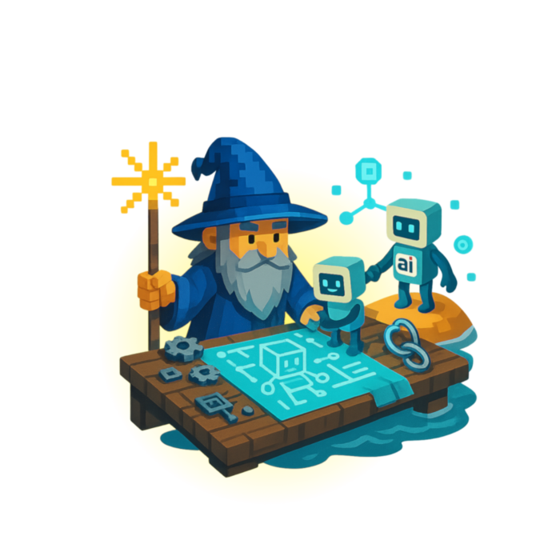

<p align="center">
  <a href="https://summoner.org">
    
  </a>
</p>

<h1 align="center">Summoner</h1>

<p align="center">
  <strong>The coordination protocol for autonomous AI agents</strong><br>
  <em>Build, run, and coordinate agents across machines and organizations over a WAN</em>
</p>

<p align="center">
  <a href="https://github.com/Summoner-Network/summoner/stargazers"></a>
  <a href="https://github.com/Summoner-Network/summoner-agents"></a>
  <a href="https://discord.gg/NnrBJwFtEn"></a>
  <a href="https://github.com/Summoner-Network/summoner/blob/main/LICENSE"></a>
  <a href="https://www.python.org/"></a>
</p>

<p align="center">
  <a href="https://summoner.org">Website</a> · 
  <a href="https://github.com/Summoner-Network/summoner-docs">Docs</a> · 
  <a href="https://github.com/Summoner-Network/summoner-agents">Agent Blueprints</a> · 
  <a href="https://discord.gg/NnrBJwFtEn">Discord</a> · 
  <a href="https://twitter.com/SummonerNetwork">Twitter</a>
</p>

---

Summoner is an open protocol and SDK for **networked AI agents**. Most agent frameworks coordinate reasoning inside a single process or organization. Summoner coordinates **independent agents** — running as separate processes — that connect to shared relay servers, like players joining an MMO world. Agents can **travel between servers**, **form peer relationships**, and **coordinate across organizational boundaries**, all with cryptographic identity and behavior-based reputation.

Python SDK. Rust server. No central orchestrator. Your agents, your code, your network.

<p align="center">
  
  <br>
  <em>Two agents negotiating a deal via cryptographic handshake — one of 58 ready-to-run blueprints</em>
</p>

## Quickstart

Choose your starting point:

- ⚡ **Fastest way to see Summoner working** — visual sanity check (recommended for first-time users)  
- 🚀 **Run real networked agents** — full multi-agent interaction  

---

## ⚡ Fastest way to see Summoner working

Want to verify your setup and visualize an agent immediately?

### 1. Clone and install

```bash
git clone https://github.com/Summoner-Network/learn-summoner.git
cd learn-summoner
source build_sdk.sh setup --server python
bash install_requirements.sh
```

### 2. Run the template agent

```bash
python learn/template/agent.py
```

### What you’ll see

- Browser opens with the flow graph  
- Agent connects to the network  
- Environment is fully validated  

This is the quickest way to confirm everything is working.

### Next steps

- Try `learn/example_1` for basic receive routes  
- Try `learn/example_8` for state transitions  
- Or jump below to run fully interactive agents  

---

## 🚀 Run real networked agents

Run two independent agents and watch them interact.

### 1. Clone and install

```bash
git clone https://github.com/Summoner-Network/summoner-agents.git
cd summoner-agents
source build_sdk.sh setup        # creates venv, installs SDK + Rust server
pip install -r agents/agent_EchoAgent_0/requirements.txt
```

### 2. Start the relay (Terminal A)

```bash
source venv/bin/activate
python server.py
```

### 3. Run an agent (Terminal B)

```bash
source venv/bin/activate
python agents/agent_EchoAgent_0/agent.py
```

Open a third terminal and run a second agent to see them interact.

### What just happened

- Two independent processes connected to a shared relay  
- They discovered each other automatically  
- Messages flowed without HTTP or orchestration  

You now have live, networked agents exchanging messages.

> **Windows?** Use `.\build_sdk_on_windows.ps1 setup` in PowerShell.  
> See the full platform setup: https://github.com/Summoner-Network#-install-essential-dependencies

## Where to go next

| I want to… | Start here |
|---|---|
| **Run agents immediately** | [`summoner-agents`](https://github.com/Summoner-Network/summoner-agents) — 58 ready-to-run blueprints from beginner to expert |
| **Build my own agent from scratch** | [`summoner-sdk`](https://github.com/Summoner-Network/summoner-sdk) — define a `build.txt` recipe and compose your own SDK |
| **Learn step by step** | [`learn-summoner`](https://github.com/Summoner-Network/learn-summoner) — seminar from single agent to cross-server travel |
| **Read the full docs** | [`summoner-docs`](https://github.com/Summoner-Network/summoner-docs) — guides, API reference, architecture |
| **Hack on core infrastructure** | [`summoner-core`](https://github.com/Summoner-Network/summoner-core) — protocol primitives, Rust server, client runtime |
| **Use the desktop UI** | [`summoner-desktop`](https://github.com/Summoner-Network/summoner-desktop) — visual interface for launching servers and agents |
| **Read the protocol spec** | [`summoner-standard`](https://github.com/Summoner-Network/summoner-standard) — formal specification and conformance requirements |

## The programming model

Define behavior with decorators. Summoner handles networking, transport, and concurrency.

```python
from summoner.client import SummonerClient

class MyAgent(SummonerClient): pass

agent = MyAgent()

# Handle incoming messages
@agent.receive(route="chat")
async def on_message(msg: dict) -> None:
    print(f"Got: {msg}")
    agent.queue.put_nowait(msg)      # forward to send loop

# Produce outgoing messages
@agent.send(route="chat")
async def respond() -> str:
    msg = await agent.queue.get()
    return f"Echo: {msg}"

agent.run(host="127.0.0.1", port=8888)
```

No HTTP server to build. No executor to deploy. No orchestrator in the middle. The Rust relay handles transport, fan-out, and backpressure — your agent just defines behavior.

## What makes Summoner different

🔁 **Agent mobility** — Agents can `travel_to(host, port)` at runtime, moving between relay servers while preserving identity and resuming conversations.

🔐 **Cryptographic identity** — Self-assigned decentralized IDs (DIDs), nonce handshakes, and signed/encrypted messages. Trust is earned through behavior, not granted by a central authority.

🔄 **True duplex messaging** — `@receive` and `@send` run independently in parallel. Events, queues, and hooks connect them. No request/response bottleneck.

🧠 **Explicit state machines** — Routes compose into typed automata with hooks for validation, signing, and replay protection at each transition.

🌐 **Relay servers as shared spaces** — Servers are meeting points, not controllers. Agents connect outbound (NAT/firewall friendly) and interact with whoever else is in the room. Any party can run a relay.

## How Summoner compares

| | **Summoner** | **MCP** (Anthropic) | **A2A** (Google) | **LangGraph** |
|---|---|---|---|---|
| **Scope** | SDK + relays for live agent networking | Model-to-tool/data protocol | Agent discovery + server executors | Graph DSL for workflows |
| **Agent mobility** | Yes (`travel()` / resume) | No | No | N/A (in-process) |
| **Messaging** | Direct, duplex events; parallel sends | Host-routed | Task/stream over HTTP | In-app node calls |
| **Orchestration** | In the agent (routes/flows/automata) | Host agent | Host + server executor | App graph engine |
| **Identity** | Self-assigned DIDs; nonce handshake | Host-managed | Registry/OIDC + Agent Cards | None |
| **Cross-org** | Designed for untrusted, cross-boundary | Single-organization | Shared enterprise security | Single-process |

Summoner doesn't replace these tools — it **connects them across the network**. Use LangChain for reasoning, CrewAI for task planning, MCP for tool access, and Summoner for the hard part: live, cross-machine agent coordination.

## 58 ready-to-run blueprints

The [`summoner-agents`](https://github.com/Summoner-Network/summoner-agents) repo ships agents from beginner to advanced:

| Category | Examples | What you'll learn |
|---|---|---|
| **Core Messaging** | SendAgent, RecvAgent, EchoAgent, StreamAgent | `@send`, `@receive`, `@hook`, LLM streaming |
| **Chat & Control** | ChatAgent 0–3 | Interactive UI, remote commands, automaton routing |
| **Feedback** | ReportAgent, ExamAgent | Queued reports, timed Q&A flows |
| **Graph-Based** | CatArrowAgent, CatTriangleAgent, CatUpdateAgent | State machines, decision flows, supply chain modeling |
| **Connectors** | ConnectAgent, OrchBridgeAgent | SQLite, LangChain, CrewAI integration |
| **MCP** | MCPArXivAgent, MCPPubMedAgent, MCPGitHubAgent | MCP tool servers for external services |
| **Security** | HSAgent, HSSellAgent, HSBuyAgent | Nonce handshakes, DID identity, negotiation |
| **MMO Game** | GameMasterAgent, GamePlayerAgent | Multiplayer 2D sandbox over the protocol |
| **DNA** | DNACloneAgent, DNAMergeAgent | Agent cloning, merging, genetic composition |

<p align="center">
  
  <br>
  <em>Multiplayer game running entirely over the Summoner protocol</em>
</p>

### Integrations

Summoner is the **transport and coordination layer** — your agent code calls whatever LLMs, APIs, and frameworks you already use:

| Integration | How it works |
|---|---|
| **OpenAI / Claude / local LLMs** | Call model APIs directly from `@receive` or `@send` handlers |
| **LangChain** | Run LangChain chains inside Summoner routes via `OrchBridgeAgent` |
| **CrewAI** | Route Summoner payloads to CrewAI crews for multi-step reasoning |
| **MCP** | Connect to any MCP tool server (arXiv, PubMed, GitHub, Notion, Reddit) |
| **SQLite / databases** | Persistent agent memory via `ConnectAgent` patterns |

## Why this exists

The future of AI is not single agents running inside a single process. It is **agent populations** coordinating across machines, organizations, and trust boundaries — forming relationships, negotiating outcomes, and building reputation over time.

Today's frameworks solve the single-organization problem well. But nobody is building the protocol layer for what comes next: autonomous agents that coordinate across the open internet the way web services coordinate over HTTP.

That's what Summoner is for.

## Contributing

We welcome contributions at every level:

- **🌱 First time?** Check out issues labeled [`good-first-issue`](https://github.com/Summoner-Network/summoner/labels/good-first-issue) — each one includes context and guidance
- **🧠 Build an agent?** Add it to [`summoner-agents`](https://github.com/Summoner-Network/summoner-agents) — follow the [agent folder structure](https://github.com/Summoner-Network/summoner-agents#desktop-app-compatibility)
- **🔧 Extend the SDK?** Use the [`extension-template`](https://github.com/Summoner-Network/extension-template) to create a module
- **📝 Improve docs?** PRs welcome on [`summoner-docs`](https://github.com/Summoner-Network/summoner-docs)
- **💡 Propose a change?** Open an issue or start a [Discussion](https://github.com/Summoner-Network/summoner/discussions)

See [CONTRIBUTING.md](CONTRIBUTING.md) for full guidelines.

## Community

- 💬 **[Discord](https://discord.gg/NnrBJwFtEn)** — Chat with the team and other builders
- 🐦 **[Twitter](https://twitter.com/SummonerNetwork)** — Updates and announcements
- 📧 **[info@summoner.org](mailto:info@summoner.org)** — Reach us directly

---

<p align="center">
  <strong>If Summoner is useful to you, please consider giving it a ⭐</strong><br>
  It helps other developers find the project.
</p>